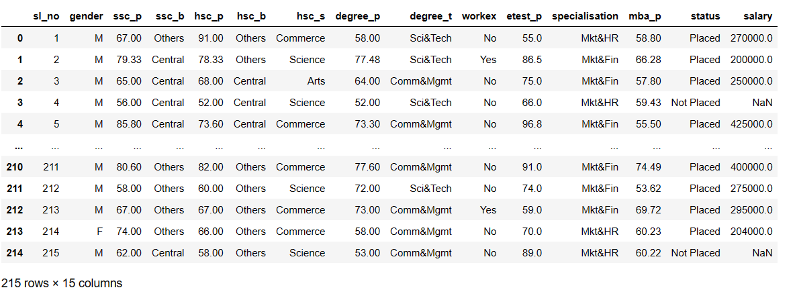
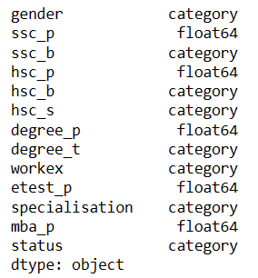
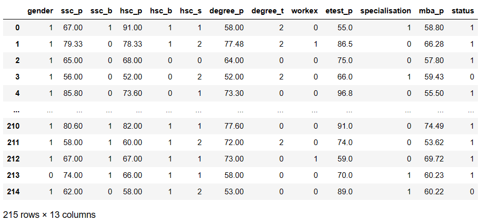
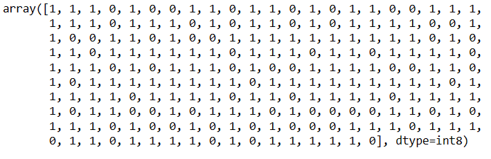
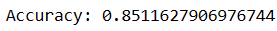
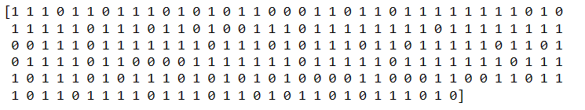
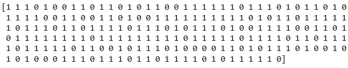
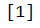
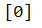

# Ex-No:5 Implementation-of-Logistic-Regression-Using-Gradient-Descent

## AIM:
To write a program to implement the the Logistic Regression Using Gradient Descent.

## Equipments Required:
1. Hardware – PCs
2. Anaconda – Python 3.7 Installation / Jupyter notebook

## Algorithm
1. Import the data file and import numpy, matplotlib and scipy.
2. Visulaize the data and define the sigmoid function, cost function and gradient descent.
3. Plot the decision boundary .
4. Calculate the y-prediction.

## Program:
```python
# Program to implement the the Logistic Regression Using Gradient Descent.
# Developed by: Krithick Vivekananda
# RegisterNumber:  212223240075

import pandas as pd
import numpy as np
import matplotlib.pyplot as plt

dataset=pd.read_csv("Placement_Data.csv")
print(dataset)

dataset = dataset.drop('sl_no',axis=1)

dataset =dataset.drop('salary',axis=1)

dataset["gender"] = dataset["gender"].astype('category')
dataset["ssc_b"] = dataset["ssc_b"].astype('category')
dataset["hsc_b"] = dataset["hsc_b"].astype('category')
dataset["degree_t"] = dataset["degree_t"].astype('category')
dataset["workex"] = dataset["workex"].astype('category')
dataset["specialisation"] = dataset["specialisation"].astype('category')
dataset["status"] = dataset["status"].astype('category')
dataset["hsc_s"] = dataset["hsc_s"].astype('category')
print(dataset.dtypes)

dataset["gender"] = dataset["gender"].cat.codes
dataset["ssc_b"] = dataset["ssc_b"].cat.codes
dataset["hsc_b"] = dataset["hsc_b"].cat.codes
dataset["degree_t"] = dataset["degree_t"].cat.codes
dataset["workex"] = dataset["workex"].cat.codes
dataset["specialisation"] = dataset["specialisation"].cat.codes
dataset["status"] = dataset["status"].cat.codes
dataset["hsc_s"] = dataset["hsc_s"].cat.codes

print(dataset)

X = dataset.iloc[:, :-1].values
Y = dataset.iloc[:, -1].values

print(Y)

theta = np.random.randn(X.shape[1])
y=Y

def sigmoid(z):
    return 1 / (1 + np.exp(-z))

def loss(theta,X,y):
    h=sigmoid(X.dot(theta))
    return -np.sum(y * np.log(h) + (1-y) * np.log(1-h))

def gradient_descent(theta, X, y, alpha, num_iterations):
    m=len(y)
    for i in range (num_iterations):
        h=sigmoid(X.dot(theta))
        gradient=X.T.dot(h-y) / m
        theta -= alpha * gradient
    return theta

theta = gradient_descent(theta, X, y, alpha=0.01, num_iterations=1000)

def predict(theta, X):
    h = sigmoid(X.dot(theta))
    y_pred = np.where(h >= 0.5,1,0)
    return y_pred

y_pred = predict(theta, X)

accuracy = np.mean(y_pred.flatten()==y)
print("Accuracy:",accuracy)

print(y_pred)

print(Y)

xnew=np.array([[0,87,0,95,0,2,78,2,0,0,1,0]])
y_prednew=predict(theta,xnew)
print(y_prednew)

xnew=np.array([[0,0,0,0,0,2,8,2,0,0,1,0]])
y_prednew=predict(theta,xnew)
print(y_prednew)
```

## Output:
# DATASET


# DATATYPES OF FEATURES


# DATASET AFTER CONVERTING THE VALUES INTO CATEGORICAL VALUES


# Y VALUES

# ACCURACY


# Y_PRED VALUES


# Y VALUES 

# Y_PREDNEW VALUES WITH DIFFERENT INPUTS





## Result:
Thus the program to implement the the Logistic Regression Using Gradient Descent is written and verified using python programming.

